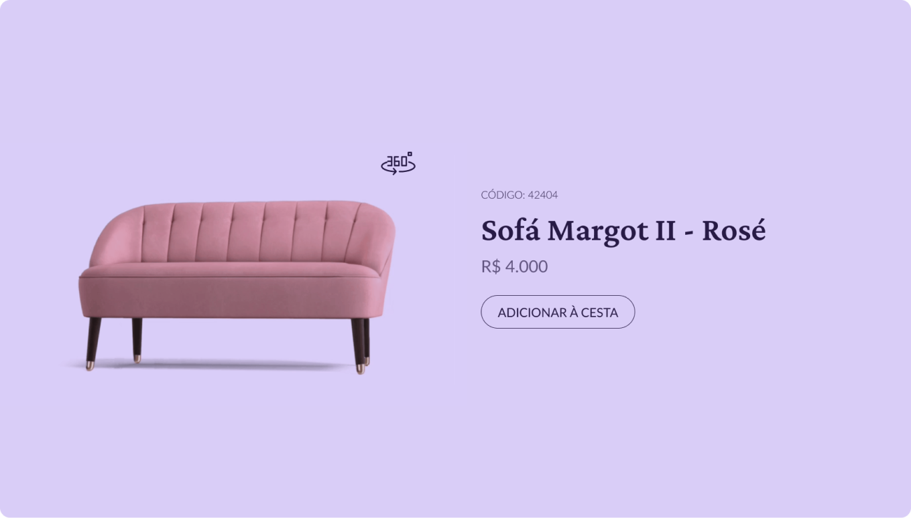

  

 

# Desafio#02 - Card de produto
Elaboração do desafio 02, que é o desenvolvimento de um card de produto.
 

  <a href="#-tecnologias">Tecnologias</a>&nbsp;&nbsp;&nbsp;|&nbsp;&nbsp;&nbsp;
  <a href="#-layout">Layout</a>&nbsp;&nbsp;&nbsp;|&nbsp;&nbsp;&nbsp;
  <a href="#-instalação">Instalação</a>&nbsp;&nbsp;&nbsp;|&nbsp;&nbsp;&nbsp;
  <a href="#memo-licença">Licença</a>

  

 

  

## 🚀 Tecnologias

Esse projeto foi desenvolvido com as seguintes tecnologias:

## 🎨 Layout

  - [Layout do projeto](https://www.figma.com/community/file/1195050984449538256)

## 💿 Instalação

|                    Script | Target                                             |
| ------------------------- | -------------------------------------------------- |
|                    `npm i` | Instala as dependências do projeto      |
|                    `npm run dev` | Roda o projeto no ambiente de desenvolvimento         |

