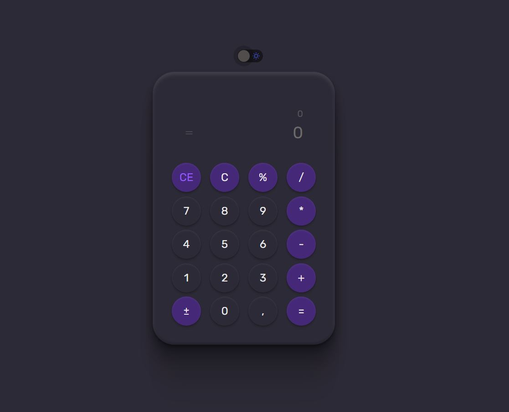
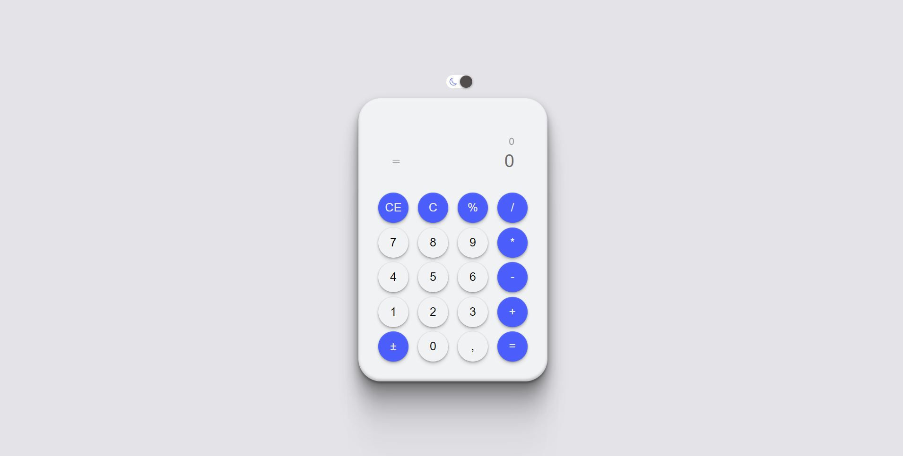

<p align="center">
    
    
</p>

# BoraCodar#05 - Calculadora
A aplicação proposta pelo quinto desafio do #boracodar é uma calculadora! <br>
O desafio inicial era apenas a construção do layout de uma calculadora de forma estática, porém, como os próprios professores dizem, temos que ir além, em busca do próximo nível!<br>

Desta forma propus o uso de `ReactJS`, `Typescript`, `Tailwindcss`, `Contextos` e a aplicação totalmente funcional!

## 🎯 Features adicionais e/ou libs adicionais
- [x] Funcionalidades de uma calculadora
- [x] Versão mobile da aplicação
- [x] Dark e Light Mode com uso do reactSwitch e contextAPI
- [x] Uso de Tailwindcss para estilização do projeto
- [x] Uso de Lib de icons (React-icons)

## Instalação
Faça o clone do repositório

Instalando as dependências
```bash
npm i
```

Rodando o servidor
```bash
npm run dev
```

## Deploy
- [Move.IT](https://rs-bora-codar-event.vercel.app/)