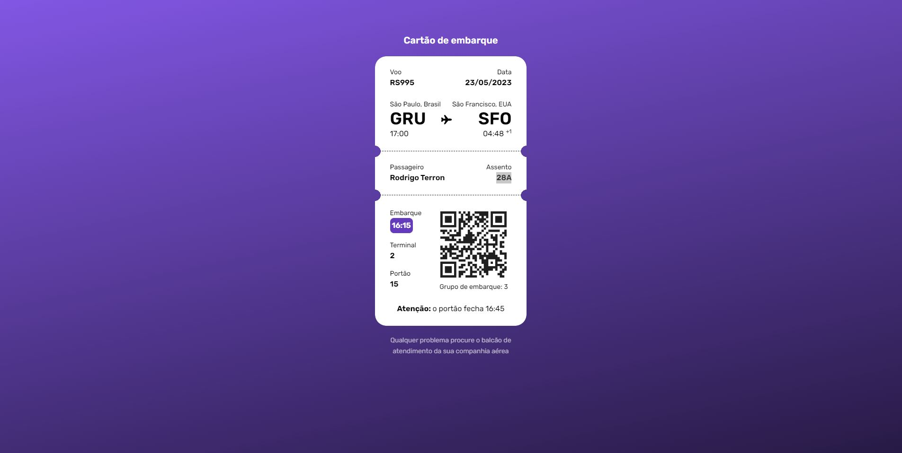
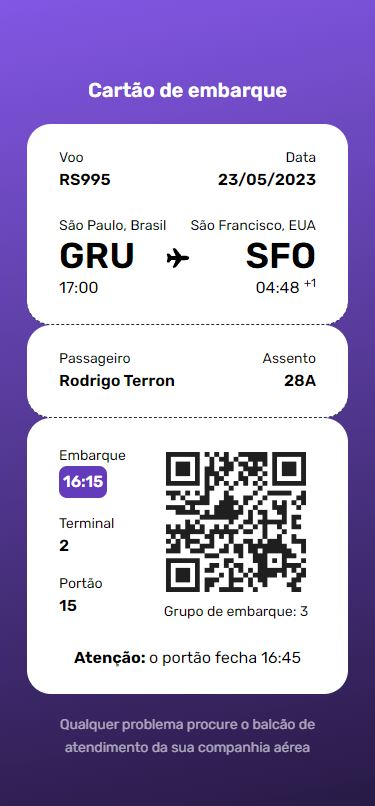

<p align="center">
    
</p>

<p align="center">
    
</p>


# BoraCodar#06 - BoardingPass
A aplicação proposta pelo quinto desafio do #boracodar é um boardingPass! <br>
O desafio inicial era apenas a construção do layout de um boardinPass de forma estática.<br>

Desta forma propus o uso de `ReactJS`, `Typescript`, `Tailwindcss`.

## Instalação
Faça o clone do repositório

Instalando as dependências
```bash
npm i
```

Rodando o servidor
```bash
npm run dev
```