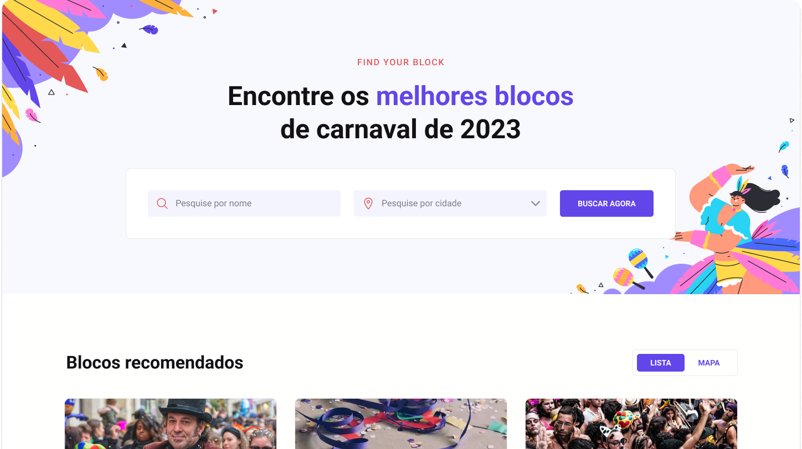

<p align="center">
    
</p>


# BoraCodar#07 - Carnaval DEV
A aplicação proposta pelo sétimo desafio do #boracodar é um buscador de festas de carnaval! <br>
O desafio inicial era apenas a construção do layout de um busca de forma estática, porém, procurando ir além, foi realizada a adição de filtros de busca<br>

Desta forma propus o uso de `ReactJS`, `Typescript`, `Tailwindcss`.

[Deploy](https://rs-bora-codar-event-ugrd.vercel.app/)

## Instalação
Faça o clone do repositório

Instalando as dependências
```bash
npm i
```

Rodando o servidor
```bash
npm run dev
```