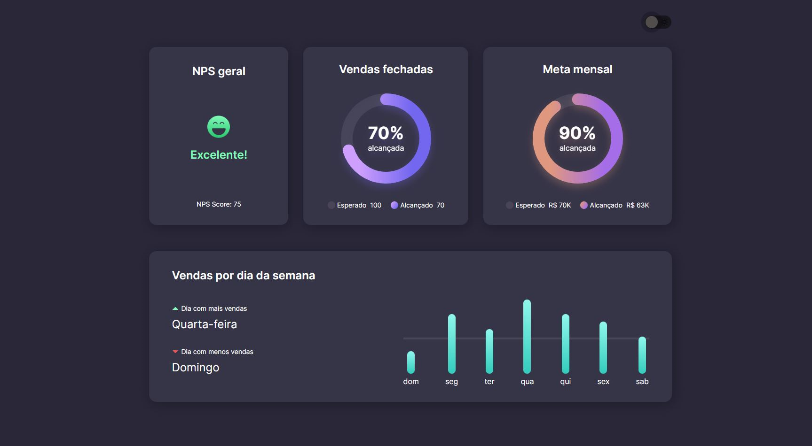

<p align="center">
    
</p>


# BoraCodar#08 - DashBoard
A aplicação proposta pelo oitavo desafio do #boracodar é painel de Dashboard de vendas! <br>

Desta forma propus o uso de `ReactJS`, `Typescript`, `Tailwindcss` e a lib `react-circular-progressbar` para criar os progressbar .

[Deploy](https://rs-boracodar-dashboard.vercel.app/)

## Instalação
Faça o clone do repositório

Instalando as dependências
```bash
npm i
```

Rodando o servidor
```bash
npm run dev
```